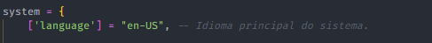

# 🛒 Fábrica de Armas

## :shield: Proteção

> Para concluir a configuração da proteção no resource de Fabricar Armas, clique [aqui](../suporte/protecao/).

## :gear: Configuração

> Para concluir a configuração do resource para que você comece a utiliza-lo em seu servidor, veja abaixo para que serve cada opção dentro do **g-config.lua**.

<details>

<summary>Webhook</summary>


```lua
['webhook'] = "",
```


A opção mostrada acima é utilizada para enviar notificações das armas que foram fabricadas atráves do sistema de Fabricação de Armas.&#x20;

* **webhook:** Link do webhook do Discord.



</details>

<details>

<summary>Animação</summary>


```lua
['anim'] = {
    category = "CASINO", 
    name = "dealone"
},
```


&#x20;A opção mostrada acima é utilizada quando o jogador inicia a fabricação de alguma arma.

* **category:** Bloco da animação que a animação fica.
* **name:** Nome da animação que o jogador irá executar

</details>

<details>

<summary>Fábricas</summary>


```lua
['factorys'] = {
    {
        ['position'] = {x = -4972.943, y = 962.277, z = 1.869, size = 1.5, i = 0, d = 0}, -- Posição, tamanho, interior e dimensão do marker da fábrica.
        ['color'] = {r = 0, g = 115, b = 255, a = 110}, -- Cor e Alpha do marker de fabricação.
        ['permissions'] = {"Console", "Admin"}, -- Permissões de acesso a fábrica de armas.

        ['blip'] = {
            use = true, -- Caso não queira utilizar blips, coloque "false", caso ao contrário, coloque "true".
            icon = 6 -- Ícone que será utilizado como ícone no radar.
        },

        ['weapons'] = { -- Armas que aparecerão no painel.
            {id = 30, name = "AK-47", ammo = 600, price = 30000, cooldown = 60}, -- ID da arma, nome de exibição, quantidade de munição que virá com a arma, valor para fabricar & tempo para fabricar (em segundos).
            {id = 31, name = "M4A1", ammo = 600, price = 30000, cooldown = 60}, -- ID da arma, nome de exibição, quantidade de munição que virá com a arma, valor para fabricar & tempo para fabricar (em segundos).
            {id = 28, name = "Uzi", ammo = 600, price = 15000, cooldown = 30}, -- ID da arma, nome de exibição, quantidade de munição que virá com a arma, valor para fabricar & tempo para fabricar (em segundos).
        }
    },
    {
        ['position'] = {x = -4944.609, y = 956.229, z = 1.869, size = 1.5, i = 0, d = 0}, -- Posição, tamanho, interior e dimensão do marker da fábrica.
        ['color'] = {r = 0, g = 115, b = 255, a = 110}, -- Cor e Alpha do marker de fabricação.
        ['permissions'] = {"Console", "Admin"}, -- Permissões de acesso a fábrica de armas.

        ['blip'] = {
            use = false, -- Caso não queira utilizar blips, coloque "false", caso ao contrário, coloque "true".
            icon = 6 -- Ícone que será utilizado como ícone no radar.
        },

        ['weapons'] = { -- Armas que aparecerão no painel.
            {id = 18, name = "Molotov", ammo = 600, price = 35000, cooldown = 75}, -- ID da arma, nome de exibição, quantidade de munição que virá com a arma, valor para fabricar & tempo para fabricar (em segundos).
            {id = 22, name = "Colt 45", ammo = 600, price = 10000, cooldown = 15}, -- ID da arma, nome de exibição, quantidade de munição que virá com a arma, valor para fabricar & tempo para fabricar (em segundos).
            {id = 34, name = "Sniper", ammo = 600, price = 50000, cooldown = 120}, -- ID da arma, nome de exibição, quantidade de munição que virá com a arma, valor para fabricar & tempo para fabricar (em segundos).
        }
    }
},
```


A opção "factorys", possibilita a criação de novos locais para que a fabricação de armas seja feita. Também é possível alterar outras coisas, veja mais sobre abaixo.

* **position:** Posição X, Y e Z de onde o painel irá ficar no mundo, tamanho do marker, interior e dimensão que o marker irá ficar.
* **color:** Cor e visibilidade do marker (RGBA).
* **permissions:** Permissões necessárias para acessar a fábrica de armas.
* **blip \[use]:** Opção para usar ou não o BLIP (utilize **true** para habilitar e **false** para desabilitar).
* **blip \[icon]:** Ícone que irá ficar no radar, para ver mais ícones clique [aqui](https://wiki.multitheftauto.com/wiki/Radar\_Blips).
* **weapons:** Opções de armas que a fábrica irá ter para fabricar.
  * **id:** ID da arma escolhida.
  * **name:** Nome que será exibido no painel.&#x20;
  * **ammo:** Munições que serão dadas  ao terminar a fabricação (caso não queira, deixe **0**).
  * **price:** Valor que o jogador terá que pagar para fabricar a arma.
  * **cooldown:** Tempo que o jogador irá ter que esperar para fabricar a arma.


Caso você queira criar uma nova fábrica, você deverá copiar da linha **2** até a linha **17** (linhas do exemplo acima), após copiar você deverá colar abaixo de onde você copiou, que no caso do exemplo acima, seria na linha **18**, olhe o exemplo abaixo.

## 

</details>


## :control\_knobs: Outros


```lua
others = {
    ['managerHud'] = function(element, state)
        return setPlayerHudComponentVisible("all", state);
    end,

    ['givePlayerWeapon'] = function(element, id, ammo)
        return giveWeapon(element, id, ammo);
    end,

    ['createRadarBlip'] = function(x, y, z, icon, size, ...)
        local blip = createBlip(x, y, z, icon, size, ...);
        setBlipVisibleDistance(blip, 250);
        return;
    end,

    ['setAnimation'] = function(element, block, anim, time, ...)
        return setPedAnimation(element, block, anim, time, ...);
    end,

    ['getPlayerID'] = function(element)
        return getElementData(element, "ID") or "N/A";
    end,
    
    ['takeMoney'] = function(element, amount)
        return takePlayerMoney(element, amount);
    end,

    ['getMoney'] = function(element)
        return getPlayerMoney(element);
    end
};
```


> Em **others** você tem possibilidade de configurar algumas opções extras para que o resource se adeque da melhor forma possível em seu servidor (alterar apenas as informações que estão após o return).

* **managerHud:** Retirar a sua HUD e o RADAR da tela ao iniciar uma partida, não é obrigatório, porém a tela do jogador fica mais "clean".
* **givePlayerWeapon:** Função para dar a arma para o jogador após a fabricação (caso você tenha inventário e as suas armas for por ele, você deverá vincula-lo aqui.
* **createRadarBlip:** Função para criar o BLIP em seu radar.
* **setAnimation:** Função para setar animação no jogador durante a fabricação.
* **getPlayerID:** Função para pegar o ID do jogador.
* **takeMoney:** Função para retirar uma quantia de dinheiro do jogador.
* **getMoney:** Função para pegar a quantidade de dinheiro do jogador.
